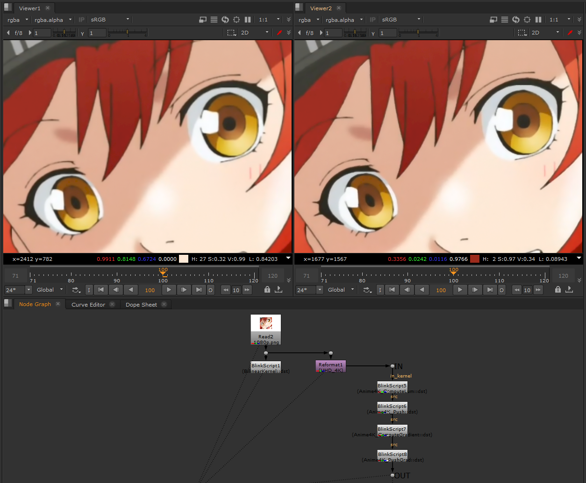

# Anime4KNuke

This repository is an implementation of Anime4K for [Nuke](https://www.foundry.com/ja/products/nuke) using Blink Script.
Original Repository is [Anime4K](https://github.com/bloc97/Anime4K)

1080pのアニメを4K解像度にアップコンバートできる高速のオープンソースのアルゴリズム「Anime4K」をFOUNDARY社のNUKEに移植してみました。

scriptsディレクトリ以下にサンプルのスクリプトがあります。

There is a sample .nk script under scripts directory.

Anim4KNuke/scripts/Anime4KNuke_sample.nk

ギズモに4つのBlinkScriptノードがあり、それぞれhlslのコードを移植してあります。

This gizmo contains 4 BlinkScript nodes. and each nodes convert from hlsl code.

- Anime4K_ComputeLum.hlsl
- Anime4K_Push.hlsl
- Anime4K_ComputeGradient.hlsl
- Anime4K_PushGrad.hlsl

- 説明動画 / Explainer video (YouTube)
 [Anime4k for Nuke](https://www.youtube.com/watch?v=7qAPTpcyqLE)

---
